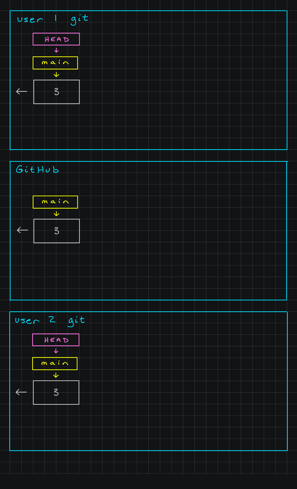
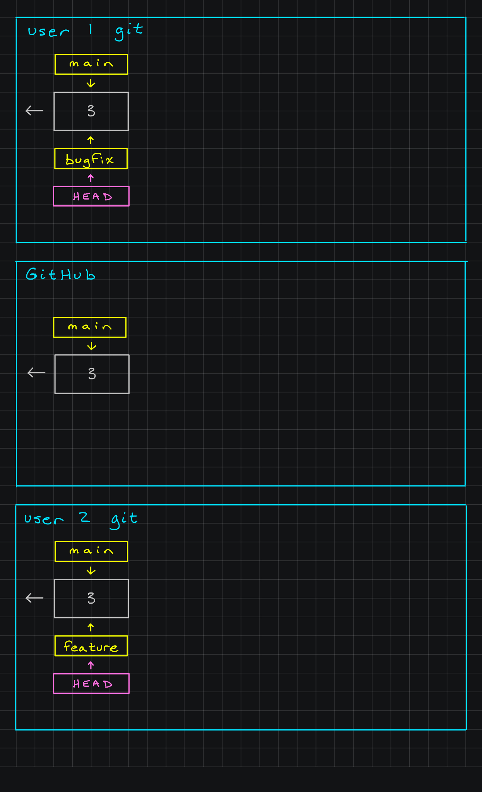
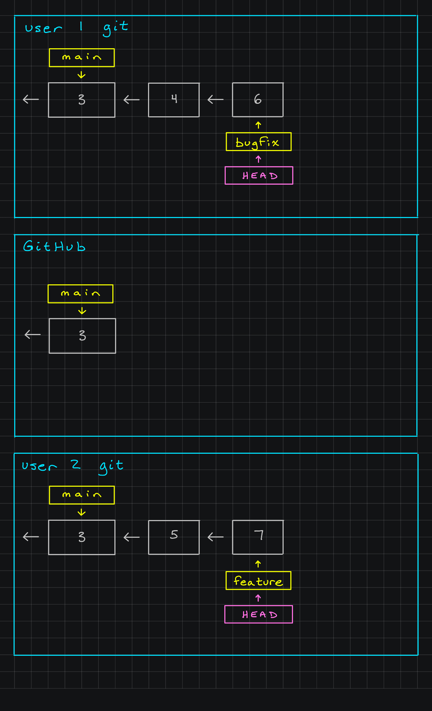
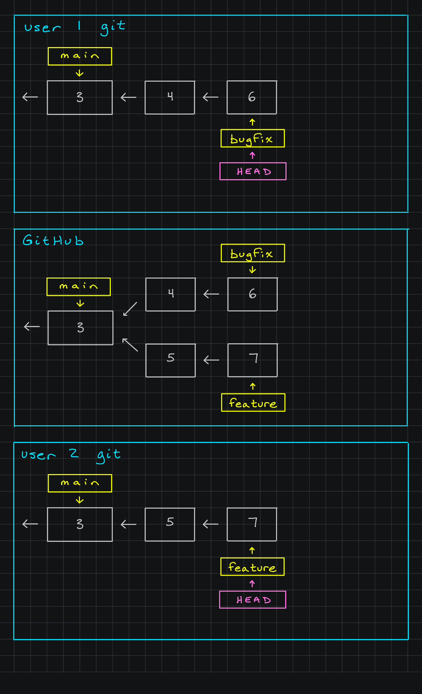
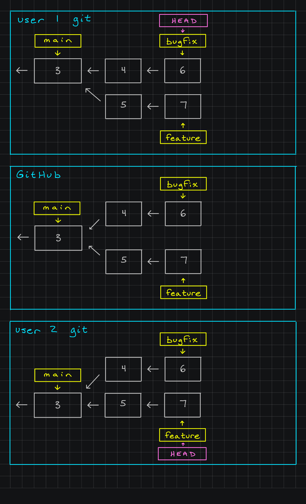
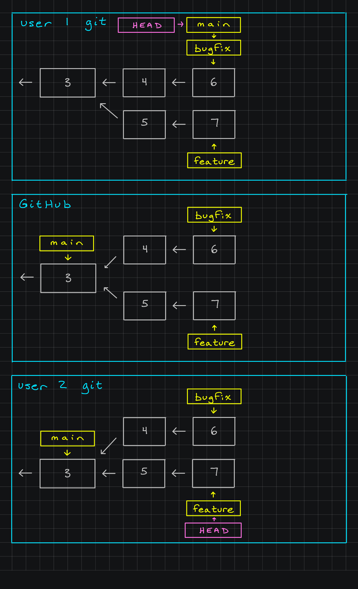
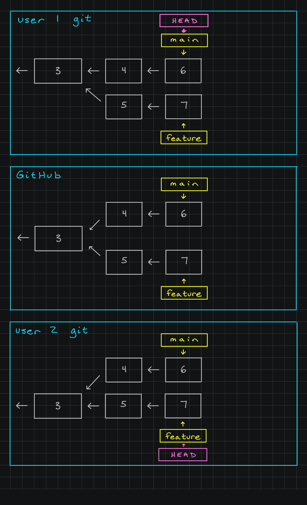
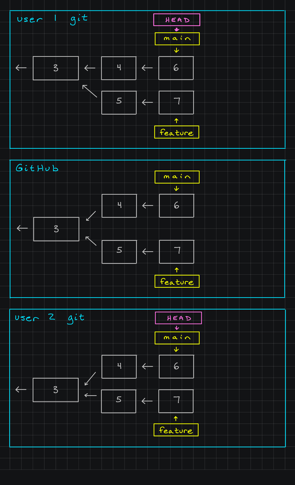
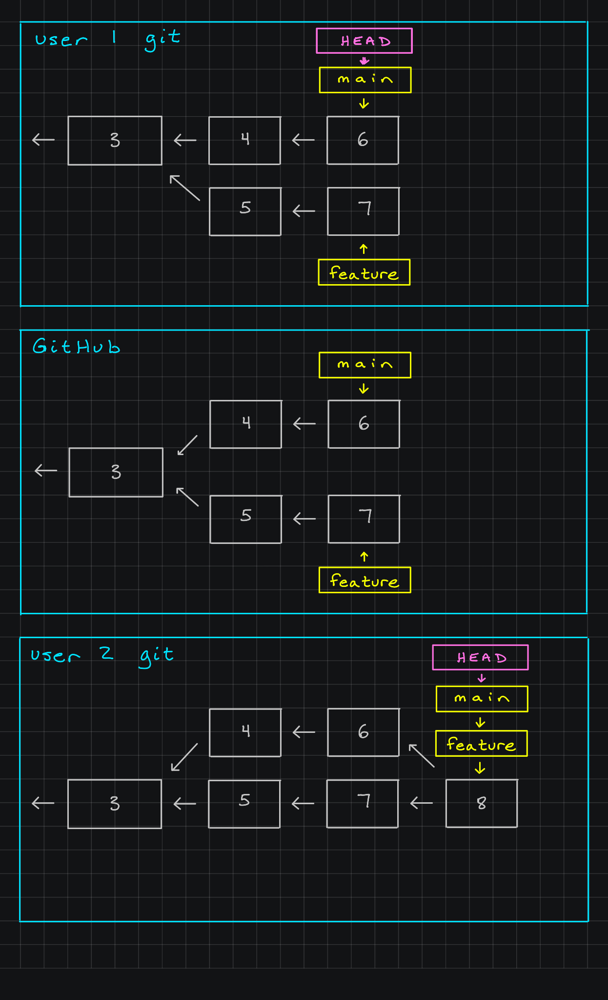
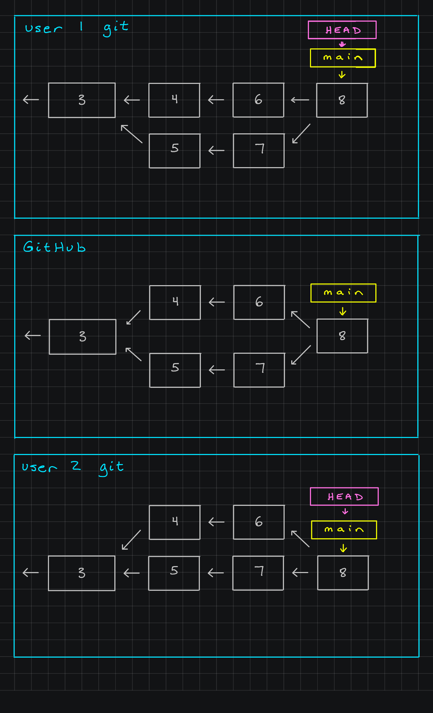

# Divergent History

When you branch out from `main` more than once and each of those new branches have made commits to make them unique, your repository now has what's called a **divergent history**, meaning the history diverges as two or more branches are making their own sets of changes.

This happens more often than you'd think, especially in projects developed by multiple people, as different people may make branches to work on different issues, features, etc.

---

## Walkthrough Example

Let's look at an example to see what happens when we have divergent history. Let's say two programmers are working on the same repository from GitHub. The repository has had commits before but only has a `main` branch that is on Commit 3, so we won't worry for now about previous commits. Both programmers - User 1 and User 2 - clone the repository to begin working on their assignments. The following diagram shows a snapshot of the current situation:

### Users Create New Branch

User 1 is going to be working on a bugfix for the repository, and to keep things separate until everything is ready, they create a `bugfix` branch using the command `git branch bugfix` and move the `HEAD` pointer to the new branch using `git checkout bugfix` so they are ready to work.

User 2 is going to be working on a new feature for the repository, and to keep things separate until everything is ready, they create a `feature` branch using the command `git branch feature` and move the `HEAD` pointer to the new branch using `git checkout feature` so they are ready to work.

The following diagram shows a snapshot of the updated situation. Note that GitHub does not have the updated branches as neither user has pushed them.

### Making Commits on New Branches

At this point, both users begin working on each of their tasks. To start out, User 1 makes Commits 4 and 6 on their `bugfix` branch. Meanwhile, User 2 makes Commits 5 and 7 on their `feature` branch.

At this point, neither user has pushed their work to GitHub, but the following diagram shows a snapshot of their work:

### Pushing New Branches and Commits to GitHub

At the end of the day, both users push their work to GitHub. User 1 pushes their `bugfix` branch using `git push origin bugfix`, and User 2 pushes their `feature` branch using `git push origin feature`.

This is our first encounter with a divergent history, as we can see via GitHub in the following diagram. We have two branches, `bugfix` and `feature` that both came from Commit 3, but have taken different paths with their own commits. We can see both Commit 4 from the `bugfix` branch and Commit 5 from the `feature` branch point back to Commit 3 as the previous commit.

### Preparing to Merge by Pulling

The next day both users are prepared to implement their solutions. Before they do, as a best practice, they update their local git repositories from GitHub using the command `git pull`. Once they've done this, both User 1 and User 2 can see the other's branch, while they continue to work on their own.

The following diagram shows that everyone sees the same information now, despite actively working on different branches:

### User 1 Merge

User 1 decides their changes are ready to go and wants to merge the `bugfix` branch back into the `main` branch. Before merging, they do a final `git pull` in case any changes are available. In this case none were, so User 1 can continue. Because the `main` branch has not been changed since the `bugfix` branch began, this is a simple merge.

To merge, User 1 moves the `HEAD` pointer to the `main` branch using the command `git checkout main`. Once there, they merge the `bugfix` branch into the `main` branch using the command `git merge bugfix` (they don't have to reference the `main` branch as that is the branch `HEAD` is currently looking at).

The following diagram shows the updated repository. Notice that the `bugfix` branch still exists, as merging a branch does not get rid of it.

### User 1 Updates GitHub

User 1 now cleans up the repository by deleting the `bugfix` branch using the command `git branch -d bugfix` and pushing the updated `main` branch to GitHub using the command `git push origin main`.

Just after this, User 2 is preparing to merge their own changes and uses `git pull` again to get any final updates, which include this merger from User 1.

The following diagram shows the updated repository. Notice that the `bugfix` branch is gone, and everyone has the most up-to-date information.

### User 2 Merge Preparation

Now that User 2 has used `git pull` again to get their most recent version, they are ready to work on merging in the new material in the `feature` branch.

In order to merge their work into the `main` branch, they need to move the `HEAD` pointer to the `main` branch just like User 1 did, with the command `git checkout main`.

The diagram below shows that User 2 successfully moved the `HEAD` pointer so they can now work from the perspective of the `main` branch.

### User 2 Complex Merge

User 1 had a simple merge because nothing had happened to the `main` branch since they started their `bugfix` branch. Now though, the `main` branch has been updated to include the information that was the `bugfix` branch, which means the `main` branch has changed.

While the command to merge for User 2 is straightforward: `git merge feature`, there is a bit more going on than User 1's merge because of the changes to the `main` branch from before.

When git tries to do a complex merge, it has a system. When User 2 writes the command `git merge feature`, it looks in 3 places for information:

1. The "common ancestor" commit between `main` and `feature`. That is, what is the most recent commit that both the `main` branch and the `feature` branch have in common. In our diagram, we can see this is Commit 3. This is used as a comparison point to help git decide what has changed between the two branches.
2. The most recent commit on the `main` branch, as this is the place we want all of the information to end up. In our diagram, we can see this is Commit 6.
3. The most recent commit on the `feature` branch, as this is where we are pulling all of the new information from. In our diagram, we can see this is Commit 7.

git will look between these three commits to determine if there is any conflicting information (this would be like both branches having edited the same file in different ways). We call these instances of conflicting information **merge conflicts**. If there are any merge conflicts, git will prompt you to look at the specific lines of code in files where the conflicts are and have you choose which you would like to be saved in the merge. This allows you to determine which information should be final, and it could be the code from either branch, or both!

Since there is more comparison going on, git automatically creates a new commit called a **merge commit** when it does a complex merge. This new commit is special as it points back to both the final branch commits it came from, since it has information in it from both of them.

In this final diagram, you can see the results of User 2 running the command `git merge feature`. Fortunately, there were no merge conflicts to resolve as User 1 and User 2 were working on separate files. We can see our merge commit is Commit 8, and it points back to both Commit 6 from the `main` branch (which is from the `bugfix` branch from User 1) and to Commit 7 from the `feature` branch. In this diagram, it makes a little more sense that we use the term **merge**, as our two sets of commits running alongside together get merged back into one.

### User 2 Updates GitHub

Now that the merge has been completed, User 2 cleans up their repository by getting rid of the `feature` branch using the command `git branch -d feature` now that `main` contains all of the information. Now that they've done this, User 2 can push the information to GitHub using `git push origin main`, and User 1 could get the information using `git pull` to get everyone's repository up-to-date with one-another again.

The following diagram shows the final state of the repository:

