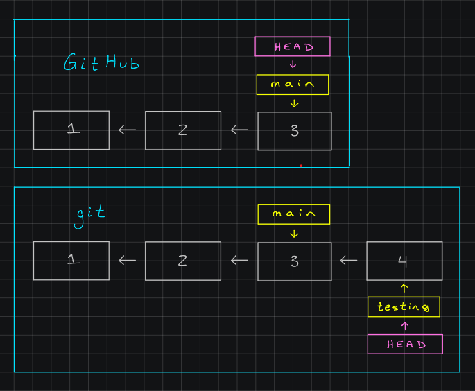
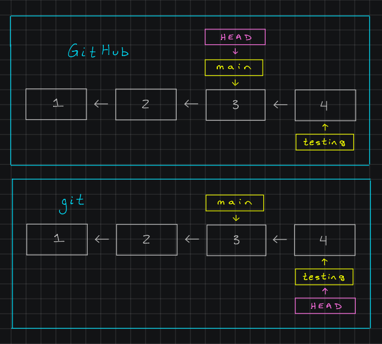
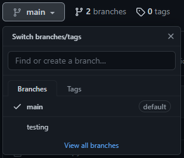
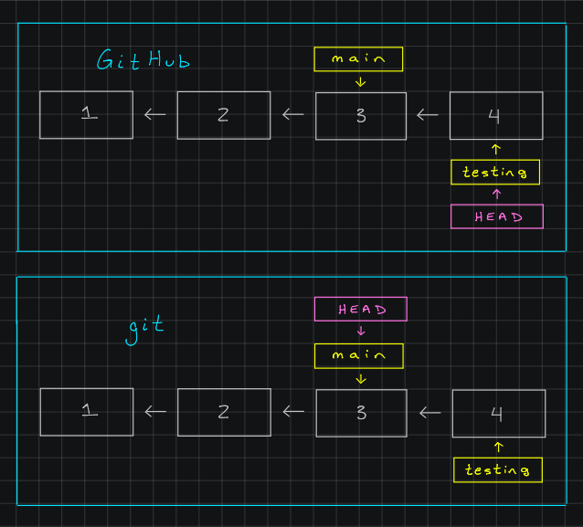

# git and GitHub

As we use features like branching with git there are a few things we need to keep in mind about how GitHub works.

If you recall, to push our committed work from git to GitHub, we use the command `git push origin main`. To break this down, `git push` is the base command, `origin` refers to the place on GitHub where we are storing this project (what we call the `remote`), and `main` refers to the branch we are pushing.

Before now, we've never had more than one branch, so the `main` in our command was a given, as it was the only branch to push. Now though, we will need to be careful, as if we only ever push to the `main` branch, our work on other branches will not end up on GitHub.

---

## Pushing to Other Branches

Let's start by taking an instance out of our previous example. The diagram below shows a state of our sample repository. In this repository, we had made 3 commits, then made a new branch called `testing`, moved over to the new branch, and made a fourth commit on the new branch `testing`, but not on `main`.

While our `HEAD` pointer is currently on our separate branch `testing`, using the command `git push` can push information from any branch with no issues. If I run the command `git push origin main` at this point, the following diagram shows the difference between what our local git sees and what GitHub sees. GitHub has no knowledge of commit 4, as it only has the information from the `main` branch, which has up to commit 3.

In order to send GitHub information about our other branch, we need to push the information related to that branch with `git push origin testing`. Note that `git push origin` has not changed, since we are still pushing information and its to our `origin`, which is GitHub. Once we do this, we now have our `testing` branch information available on GitHub as well, and both of our branches can now be accessed remotely! The following diagram shows that git and GitHub now have the same information.

Also note that the `HEAD` pointer on GitHub is on the `main` branch, even though we just pushed the `testing` branch. This is because `main` is the default branch of the repository, and so GitHub will automatically choose to view that one on it's own. We can choose to view a different branch by clicking on the button near the top of the repository with `main` written on it, producing a dropdown of the branches available for us to view. This is what this would look like for our repository:

Using this dropdown, we can select `testing` which will show us the version of the repository most recently associated with that branch (the information we just pushed). Note that switching branches in git does not affect the `HEAD` pointer in GitHub and vice-a-versa, they are two independent systems. The following diagram shows what happens if we switch to `testing` on GitHub and move to `main` on git using `git checkout main`:

Since both of these locations (git and GitHub) have up-to-date information due to our pushes of each branch, they can each move through the branches on their own. This is extremely helpful when people are developing together, as the changes one person makes to a branch they have made in a repository, can be accessible to the other people working the same repository.